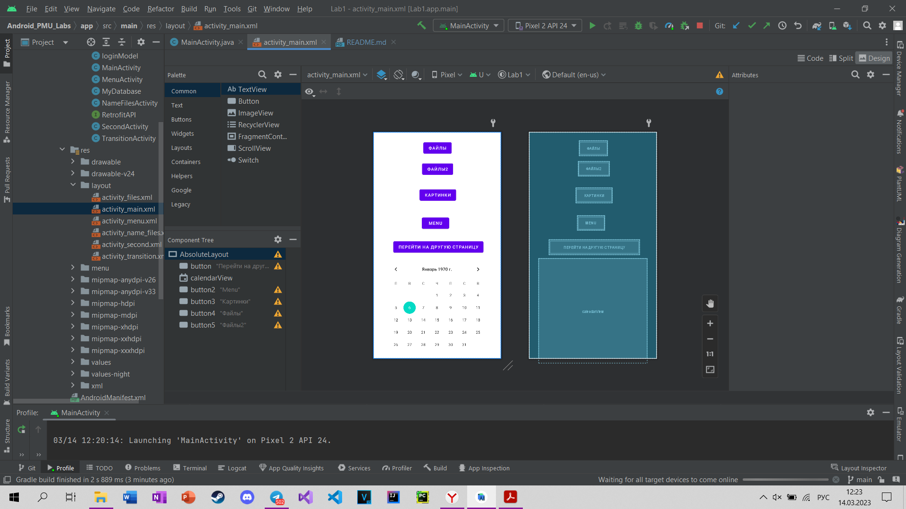
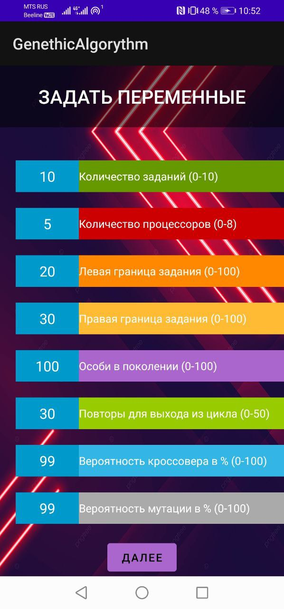
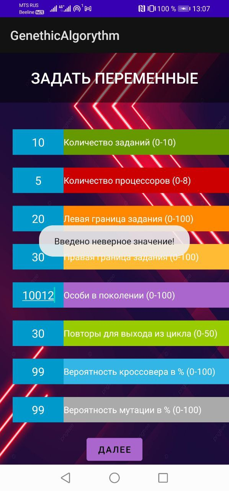

# PMU_Android_labs
## Колисниченко "Программирование для Android" 177-183 (13-й в списке)
## Глава 8
Предпочтения хранятся в ХМL-файлах в незашифрованном виде в локальном хранилище.
Они невидимы, поэтому для простого пользователя недоступны.
При работе с предпочтениями следует учитывать следующие моменты. Поскольку
они хранятся в незашифрованном виде, то не рекомендуется сохранять в них чувствительные
данные типа паролей или номеров банковских карт. Кроме того, они
представляют данные, ассоциированные с приложением, и через панель управления
приложениями пользователь может удалить эти данные вместе с приложением.
Существуют разные типы доступа к предпочтениям:
+ ```MODE_PRIVATE```
+ ```MODE_WORLD_READABLE```
+ ```MODE_WORLD_WRITABLE```

Для работы с разделяемыми предпочтениями в классе ```Activity``` (точнее, в его базовом
классе ```Context```) имеется метод ```getSharedPreferences()```:
```
import android.content.SharedPreferences;
// .......................... .
SharedPreferences settings = getSharedPreferences("PreferencesName", MODE PRIVATE) ;
```
Первый параметр метода указывает на название предпочтения. В показанном случае
это название: ```"PreferencesName"```. Если предпочтений с подобным названием
нет, то они создаются при вызове этого метода. Второй параметр указывает на
режим доступа. В нашем случае режим описан константой ```MODЕ_PRIVATE```.
Класс ```android.content.SharedPreferences``` предоставляет ряд методов для управления
предпочтениями:
+ ```contains(String key)``` - возвращает ```true```, если в настройках сохранено значение с ключом ```key```;
+ ```getAll()``` - возвращает все сохраненные в настройках значения;
+ ```getBoolean(String key, boolean defValue)``` - возвращает из настроек значение типа ```Boolean```, которое имеет ключ ```key```. Если элемента с таким ключом не окажется, то возвращается значение ```defValue```, передаваемое вторым параметром;
+ ```getFloat(String key, float defValue)``` - возвращает значение типа ```int``` с ключом ```key```;
+ ```getLong(String key, long defValue)``` - возвращает значение типа ```long``` с ключом ```key```;
+ ```getString(String key, String defValue)``` - возвращает строковое значение с ключом ```key```;
+ ```getStringSet(String key, Set<String> defValues)``` - возвращает массив строк с ключом ```key```;
+ ```edit()``` - возвращает объект ```SharedPreferences.Editor```, который используется для редактирования настроек.

Для управления настройками используется объект класса ```SharedPreferences.Editor```,
возвращаемый методом ```edit()```. Он определяет следующие методы:
+ ```clear()``` - удаляет все настройки;
+ ```remove(String key)``` - удаляет из настроек значение с ключом key;
+ ```putBoolean(String key, boolean value)``` - добавляет в настройки значение типа ```boolean``` с ключом ```key```;
+ ```putFloat(String key, float value)``` - добавляет в настройки значение типа ```float``` с ключом ```key```;
+ ```putInt(String key, int value)``` - добавляет в настройки значение ```int``` с ключом ```key```
+ ```putLong(String key, long value)``` - добавляет в настройки значение типа ```long``` с ключом ```key```;
+ ```putString(String key, String value)``` - добавляет в настройки строку с ключом ```key```;
+ ```putStringSet(String key, Set<String> values)``` - добавляет в настройки строковый массив;
+ ```commit()``` - подтверждает все изменения в настройках;
+ ```apply()``` - так же, как и метод ```comit()```, подтверждает все изменения в настройках,
  однако измененный объект ```SharedPreferences``` вначале сохраняется во временной
  памяти и лишь затем в результате асинхронной операции записывается
  на мобильное устройство.

Теперь рассмотрим практический пример. Создайте новое приложение с пустой
активностью (__Empty Activity__). В файле activity_main.xml определим интерфейс пользователя
(листинг 8.3).

#### Листинг 8.3. Интерфейс приложения (файл activity_main.xml)
```xml
<LinearLayout кmlns:android="http://schemas.android.com/apk/res/android"
  android:layout_width="match_parent"
  android:layout_height="match_parent"
  android:orientation="vertical">
  
  <EditText
    android:id="@+id/nameBox"
    android:layout_width="match_parent"
    android:layout_height="wrap_content"
    android:hint="Bвeдитe имя"/>
  <Button
    android:layout_width="wrap_content"
    android:layout_height="wrap_content"
    android:text="Coxpaнить"
    android:onClick="saveName"/>
  <TextView
    android:id="@+id/nameView"
    android:layout_width="wrap_content"
    android:layout_height="wrap_content" />
  <Button
    android:layout_width="wrap_content"
    android:layout_height="wrap_content"
    android:text="Пoлyчить имя"
    android:onClick="getName"/>
</LinearLayout>   
```

На экране присутствуют две кнопки: для сохранения и для вывода ранее сохраненного
значения, а таюке поле для ввода и текстовое поле для вывода сохраненной
настройки (рис. 8.5).


Теперь займемся кодом приложения, приведенном в файле MainActivity.java (листинг
8.4).
#### Листинг 8.4. Полный код приложения (файл MainActivity.java)
```java
package corn.example.den.prefs;

import android.content.SharedPreferences;
import android.support.v7.app.AppCornpatActivity;

import android.os.Bundle;
import android.view.View;
import android.widget.EditText;
import android.widget.TextView;

public class MainActivity extends AppCompatActivity {

    private static final String PREFS_FILE = "Account";
    private static final String PREF_NАМЕ = "Name";
    SharedPreferences settings;
    @OVerride
    protected void onCreate(Bundle savedinstanceState) {
        super.onCreate(savedinstanceState);
        setContentView(R.layout.activity_main);
        settings = getSharedPreferences(PREFS_FILE, MODE_PRIVATE);
    }
  
    public void saveName(View view) {
        // получаем введенное имя
        EditText nameBox = (EditText) findViewByid(R.id.nameBox);
        String name = nameBox.getText() .toString();
        // сохраняем его в настройках
        SharedPreferences.Editor prefEditor = settings.edit();
        prefEditor.putString(PREF_NAМE, name);
        prefEditor.apply();
    }
  
    public void getName(View view) {
        // получаем сохраненное имя
        TextView nameView = (TextView) findViewByid(R.id.nameView);
        String name = settings.getString(PREF_NAМE,"n/a");
        nameView.setText(name);
    }
}
```

Запустите приложение. Если предпочтения (настройки) нет, приложение отобразит
значение по умолчанию - __n/a__ (рис. 8.6).
Теперь введите имя (см. рис. 8.6), нажмите кнопку __Сохранить__, а затем кнопку
__Получить имя__. Вы должны увидеть введенное ранее имя пользователя (рис. 8.7).
Часто возникает задача автоматичеcки сохранить вводимые данные при выходе
пользователя из ```activity```. Для этого мы можем переопределить метод ```onPause``` (листинг
8.5).




#### Листинг 8.5. Автоматическое сохранение настроек
```java
package com.example.den.prefs;

import android.content.SharedPreferences;
import android.support.v7.app.AppCornpatActivity;
import android.os.Bundle;
import android.view.View;
import android.widget.EditText;

public class MainActivity extends AppCornpatActivity {

  private static final String PREFS_FILE = "Account";
  private static final String PREF_NAME = "Name";
  EditText nameBox;
  SharedPreferences settings;
  SharedPreferences.Editor prefEditor;

  @OVerride
  protected void onCreate(Bundle savedinstanceState) {
    super.onCreate(savedlnstanceState);
    setContentView(R.layout.activity_main);

    nameBox = (EditText) findViewByid(R.id.nameВox);
    settings = getSharedPreferences(PREFS_FILE, MODE_PRIVATE);

    // nолучаем на стройки
    String name = settings.getString(PREF_NAМE, "");
    nameBox.setText(name);
  }

  @OVerride
  protected void onPause() {
    super.onPause();

    EditText nameBox = (EditText) findViewByid(R.id.nameВox);
    String name = nameBox.getText().toString();
    // сохраняем в настройках
    prefEditor = settings.edit();
    prefEditor.putString(PREF_NAМE, nameBox.getText().toString());
    prefEditor.apply();
  }

  public void saveName(View view) {

  }

  public void getName(View view) {

  }
}
```

На этом мы завершаем разговор о базовом программировании для Android и переходим
к следующей части книги, в которой будем разбираться с построением
сложных Аndrоid-приложений .

