# Genetic Algorithm Android app

[](
https://developer.android.com/studio/intro)
[](
https://www.python.org/)
[](
https://www.java.com)

## Table of Contents

+ [About](#about)
+ [Requirements](#installing)
+ [Application Review](#apprev)

## About <a name = "about"></a>

This project presents a mobile implementation of the calculation of the solution of a specific task of the theory of schedules by the Goldberg method with different formation of the initial generation.

Python support is provided by:

[](
https://chaquo.com/chaquopy/)

## Requirements <a name = "installing"></a>

1. build.gradle(project) 
    ```androiddatabinding
    buildscript {
        repositories {
            maven { url "https://chaquo.com/maven"}
        }
        dependencies {
            classpath "com.chaquo.python:gradle:14.0.2"
        }
    }
    
    plugins {
        id 'com.android.application' version '7.4.0' apply false
        id 'com.android.library' version '7.4.0' apply false
        id 'com.chaquo.python' version '14.0.2' apply false
    }
    ```
2. build.gradle(:app)
    ```androiddatabinding
    plugins {
         id 'com.android.application'
         id 'com.chaquo.python'
    }
    
    
    
    android {
        namespace 'com.example.lab1'
        ompileSdk 33

        defaultConfig {

            sourceSets {
                main {
                    python.srcDir "some/main/python"
                }
            }

            python {
                version "3.8"
                buildPython *your python.exe file* (for e.g. "/usr/bin/python3" or "C:/ProgramData/Anaconda3/python.exe")
                pip {
                    install "tqdm"
                    install "colorama"
                    install "matplotlib"
                } 
            }

            ndk {
                abiFilters "armeabi-v7a", "arm64-v8a", "x86", "x86_64"
            }

            applicationId "com.example.lab1"
            minSdk 24
            targetSdk 33
            versionCode 1
            versionName "1.0"

            testInstrumentationRunner "androidx.test.runner.AndroidJUnitRunner"
        }

        buildTypes {
            release {
                minifyEnabled false
                proguardFiles getDefaultProguardFile('proguard-android-optimize.txt'), 'proguard-rules.pro'
            }
        }
        compileOptions {
            sourceCompatibility JavaVersion.VERSION_1_8
            targetCompatibility JavaVersion.VERSION_1_8
        }
    }
    
    dependencies {
        implementation 'com.github.MikeOrtiz:TouchImageView:1.4.1'
        implementation 'io.apisense:rhino-android:1.0'
        implementation 'androidx.appcompat:appcompat:1.6.1'
        implementation 'com.google.android.material:material:1.8.0'
        implementation 'androidx.constraintlayout:constraintlayout:2.1.4'
        implementation 'androidx.navigation:navigation-runtime:2.5.3'
        testImplementation 'junit:junit:4.13.2'
        androidTestImplementation 'androidx.test.ext:junit:1.1.5'
        androidTestImplementation 'androidx.test.espresso:espresso-core:3.5.1'
        implementation 'com.google.code.gson:gson:2.8.9'
        implementation 'com.squareup.retrofit2:retrofit:2.9.0'
        implementation 'com.squareup.retrofit2:converter-gson:2.5.0'
    }
    ```
    
## Application Review <a name = "apprev"></a>

### 1. When the program starts, its start window appears, where we can set the starting variables.


       
    If the data entered by the user is correctly validated, the transition 
    to the next window occurs, otherwise errors by type pop up:
      
___
      
    Error #1 (going beyond acceptable values):


___

    Error #2 (Incorrect data type):


---

### 2. Switching to the next window with correct validation of the entered data:


---

    When you click on the "ГОТОВЫЙ ВАРИАНТ"(“READY OPTION”) button, 
    the matrix is read from the file system generated during the old iterations 
    and goes to the next:

 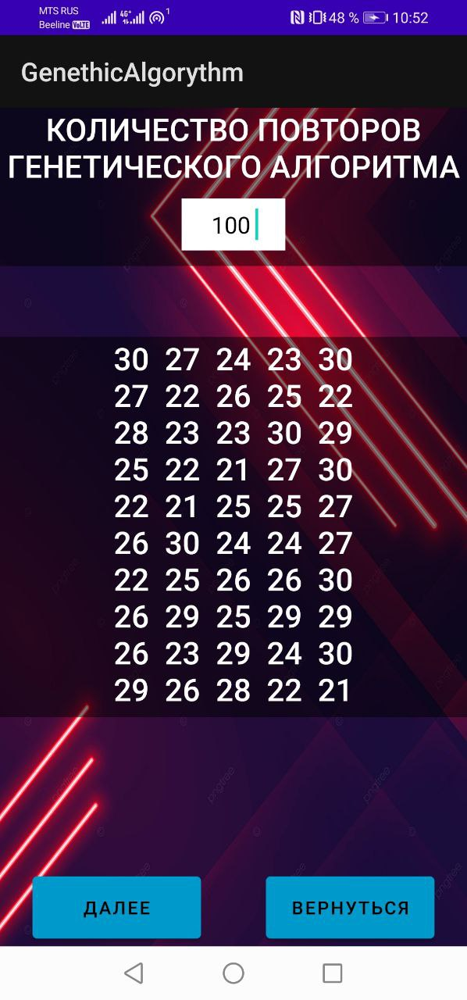

---

    When you click on the "НОВАЯ МАТРИЦА"(“NEW MATRIX”) button, 
    a new matrix is generated, uploaded to a file inside the system 
    and moved to the next window:

 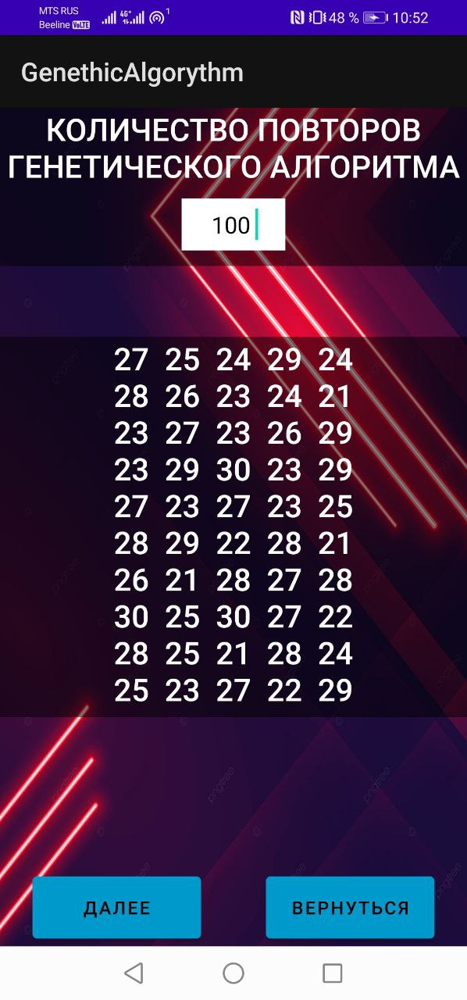

---

    Validation check for the field (EditText Object) repeats:

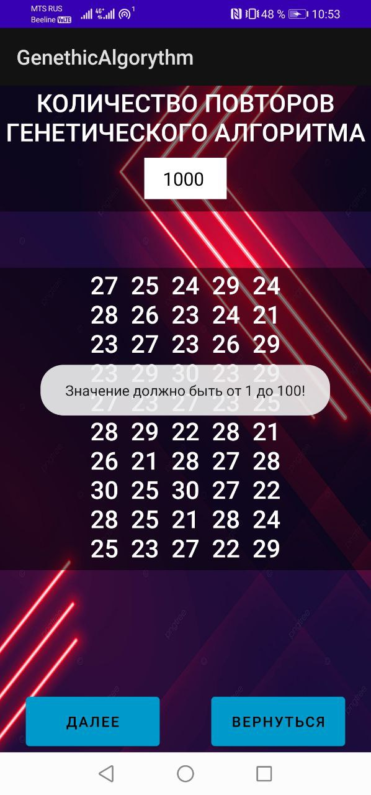 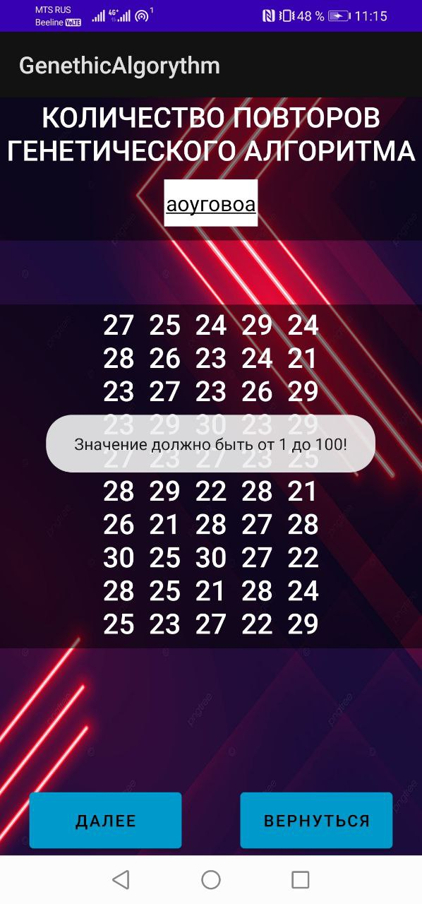

---

### 3. Switching to the next window with correct data validation:

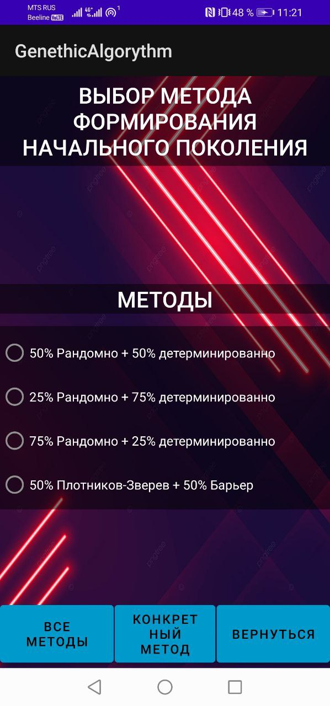

---

    When you click on the "КОНКРЕТНЫЙ МЕТОД"(“SPECIFIC METHOD”) button without 
    selecting more than one of the methods (RadioButton objects), the following 
    error window will pop up:
    
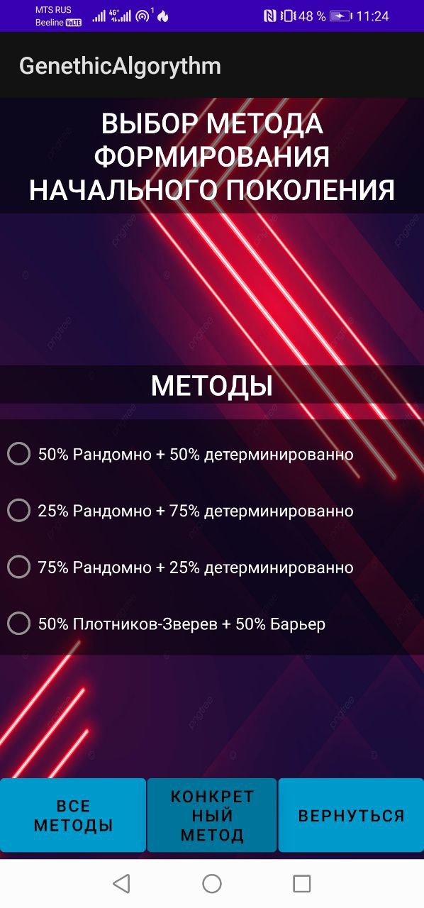 

---

    Transition with the Method Selection combination + Specific Method/All methods:


---

    When you click on the “NEXT” button without selecting any of the methods 
    (RadioButton objects), the following error window will pop up:

 

---

### 4. Switching to the next window with correct data validation:


---

    When you click on the ("СТАРТ")“START” button, the Genethic Algorythm start 
    is initialized:

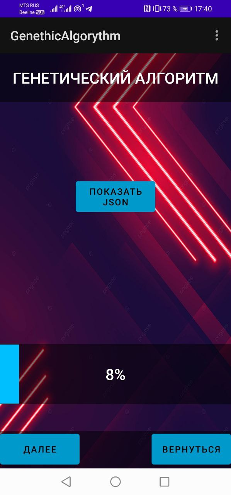 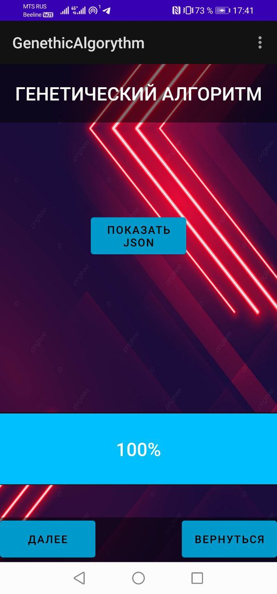

---

    When you click on the “SHOW JSON” button, a JSON file is shown that is fed 
    inside the python-script:

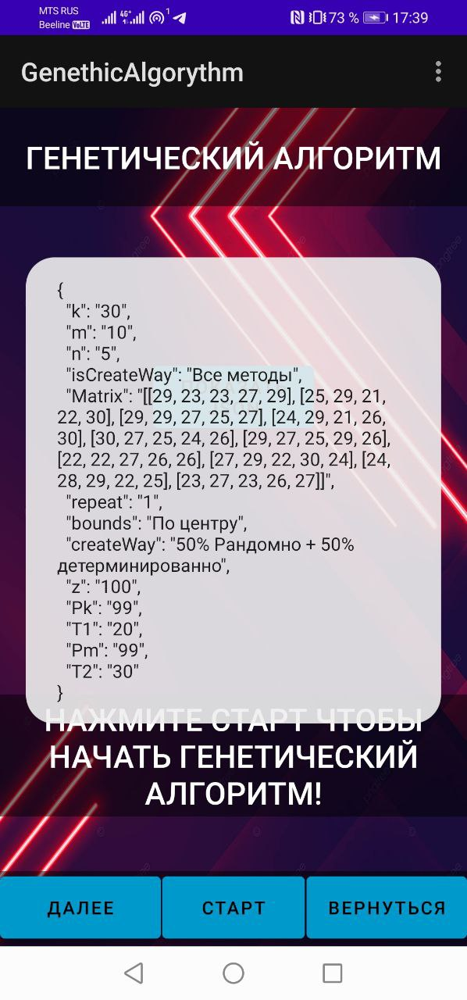

---

### 5. Switching to the next window when clicking on the "ДАЛЕЕ"(“NEXT”) button:

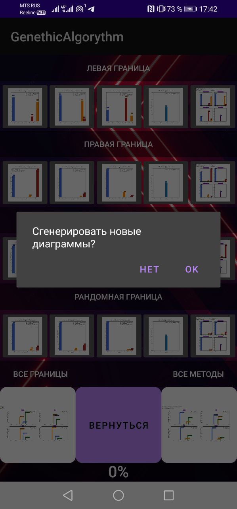

---

    When you click on the “OK" button, the generation of histograms begins:

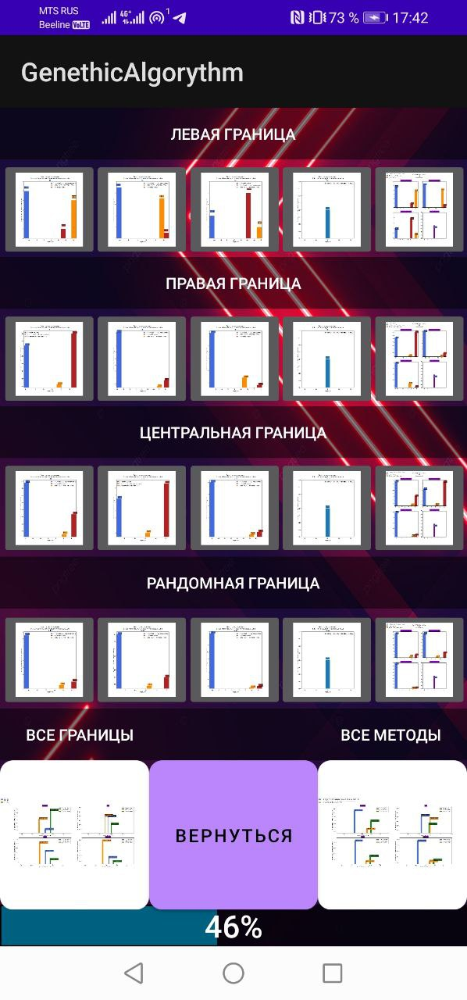

---

    Clicking on the histogram takes you to the demo window:

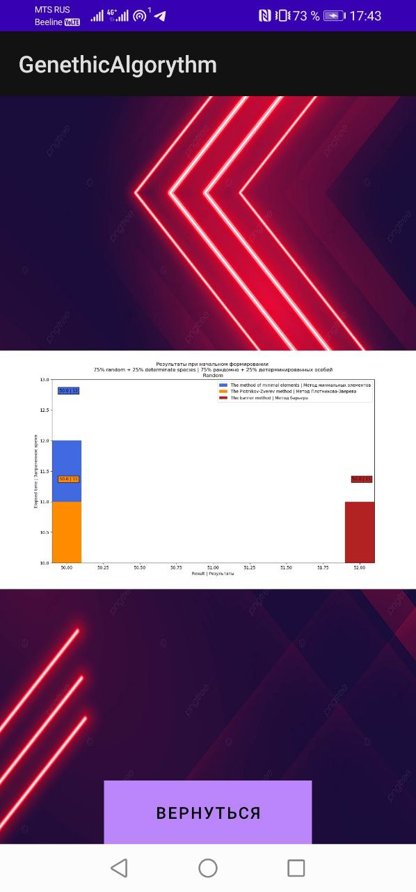 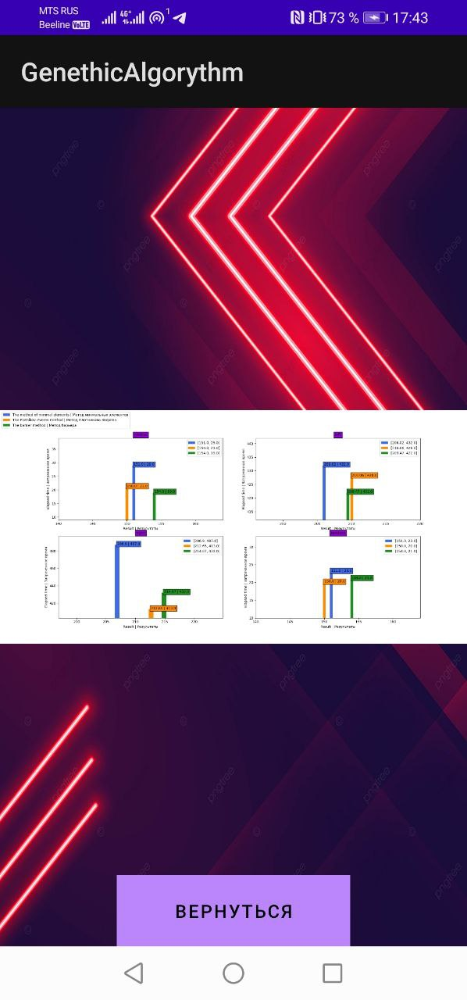

---
